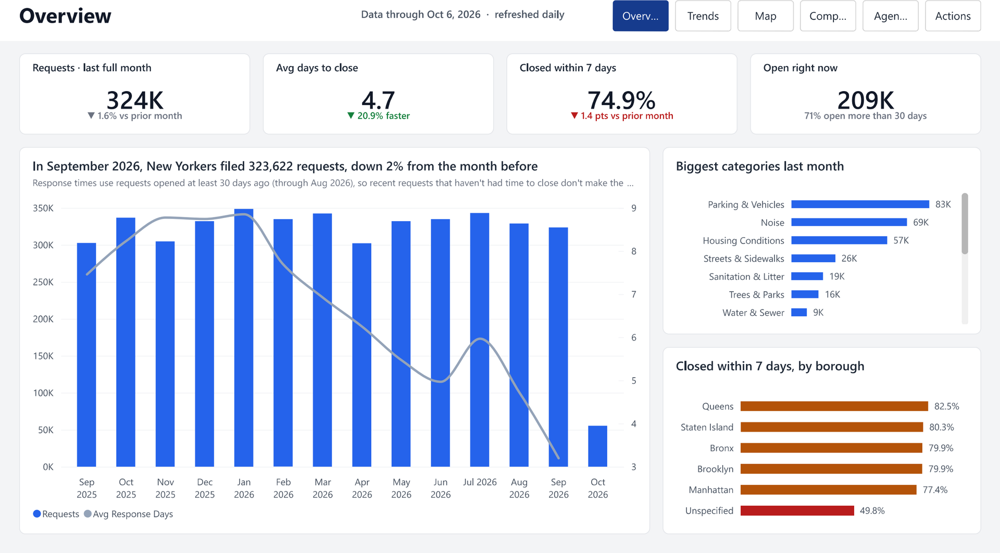
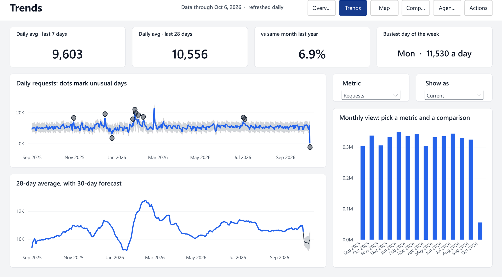
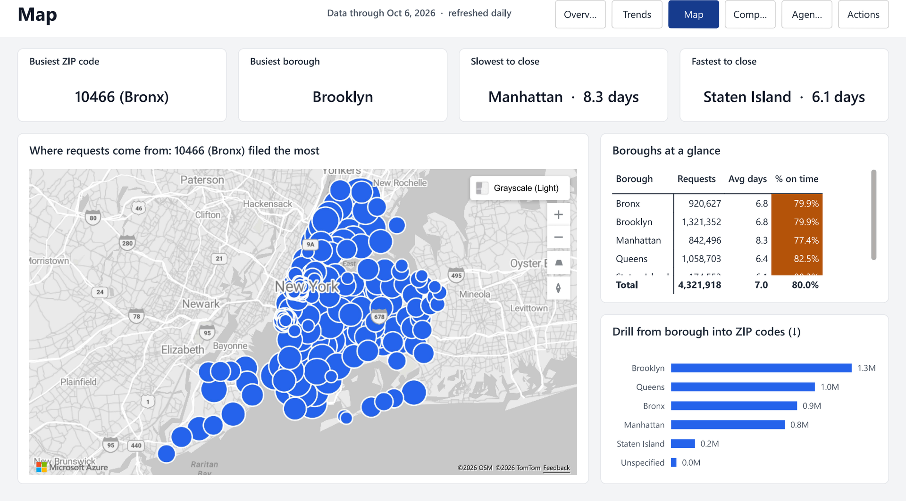
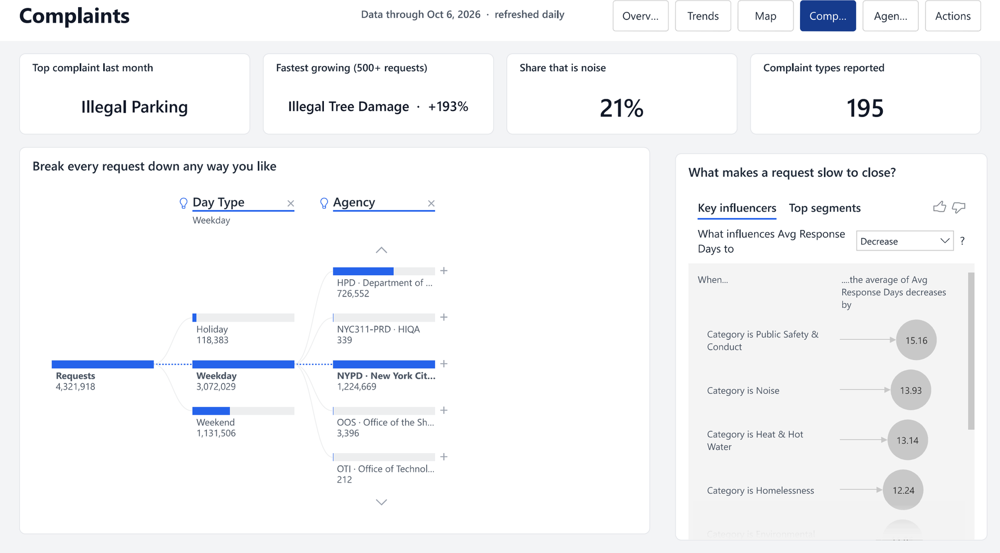
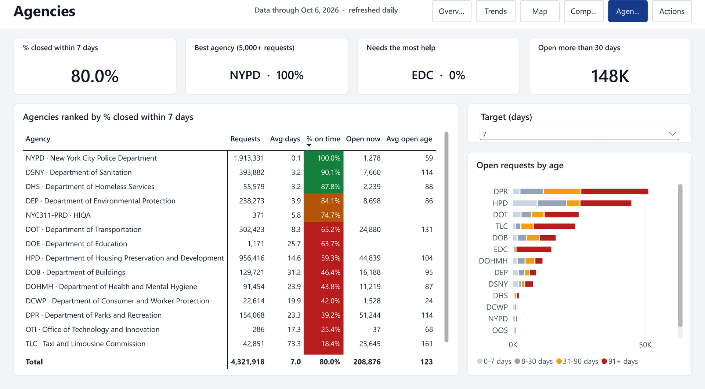
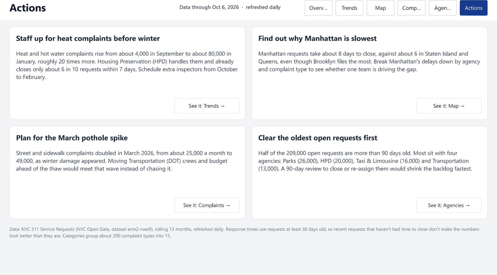

# NYC 311: An Auto-Refreshing Power BI Dashboard

**Business question:** *New Yorkers file over 10,000 requests to 311 every day: noise, blocked driveways, no heat, potholes. Which problems drive that volume, where is the city slow to respond, and what should it do about it?*

I built a pipeline that pulls every 311 request from the past 13 months out of NYC's live open-data API, cleans it, and feeds a 6-page Power BI report. The report **updates itself every morning**, with no computer of mine switched on.



| | |
|---|---|
| **Data** | [NYC 311 Service Requests](https://data.cityofnewyork.us/Social-Services/311-Service-Requests-from-2010-to-Present/erm2-nwe9) (NYC Open Data): about 4.3 million requests, rolling 13 months, updated daily |
| **Tools** | Python (sodapy, pandas), GitHub Actions, Power BI (Power Query, DAX, star-schema model) |
| **Deliverables** | [Full report (PDF)](output/NYC_311_Dashboard.pdf) · [Power BI project](powerbi/NYC_311.pbip) · [Page screenshots](powerbi/images/) · [Insights memo (PDF)](output/Insights_Memo.pdf) |

---

## What I found (as of early October 2026)

- **The city closes 80% of requests within a week.** The average request takes about 7 days.
- **That average hides a huge gap between agencies.** The police (NYPD) handle 44% of all requests and close almost all of them within hours. Parks closes only 39% within a week, and the Taxi & Limousine Commission only 18%.
- **The backlog is old.** About 209,000 requests are still open, and **half of them are more than 90 days old**. Four agencies hold most of them: Parks, Housing (HPD), Taxi & Limousine, and Transportation (DOT).
- **Complaints follow the seasons.** Heat and hot-water complaints rise from about 4,000 in September to about 80,000 in January. Street and sidewalk complaints doubled in March, when winter damage showed up as potholes.
- **Manhattan is the slowest borough** (about 8 days to close a request) even though Brooklyn files the most.

## Recommendations

1. **Staff up for heat complaints before winter.** Housing handles them and already closes only about 6 in 10 within a week. Extra inspectors from October to February would meet the surge instead of falling behind it.
2. **Find out why Manhattan is slowest.** Break Manhattan's delays down by agency and complaint type to see whether one team is driving the gap.
3. **Plan for the March pothole spike.** Move Transportation crews and budget ahead of the thaw.
4. **Clear the oldest open requests first.** A 90-day review at the four agencies that hold most of the old backlog would shrink it fastest.

---

## The report

| Page | What it answers |
|---|---|
| **Overview** | Is service getting better or worse? Requests, days to close, % closed within 7 days, and open backlog, each compared with the month before |
| **Trends** | When do spikes happen? Daily requests with unusual days flagged automatically, a 30-day forecast, and a monthly chart where you pick the metric and the comparison (vs last month, vs last year) |
| **Map** | Where do requests come from, and where is service slow? A bubble map of every ZIP code, plus a borough-to-ZIP drill-down |
| **Complaints** | What drives volume, and what makes a request slow? A decomposition tree you can split any way, plus an AI "key influencers" chart |
| **Agencies** | Who meets the target? Every agency ranked by % closed on time (you choose the target: 1, 3, 7, 14 or 30 days), plus open requests by age |
| **Actions** | The four recommendations above, each linked to the page that backs it up |

There's also a hidden **drill-through page**: right-click any complaint type to see its own trend, boroughs and agencies.

| | | |
|---|---|---|
|  |  |  |
|  |  | |

**Power BI features used:**
- Power Query: a reusable function plus a parameter, so the scheduled refresh works without a gateway
- Star-schema model: 3 fact tables and 6 dimension tables
- About 60 DAX measures, including time intelligence and dynamic titles
- A calculation group (MoM %, YoY %, YTD)
- A field parameter (metric switcher)
- Conditional formatting driven by measures
- Drill-down, drill-through and a custom report-page tooltip
- Anomaly detection, forecasting, the decomposition tree and key influencers
- A custom theme on an 8px layout grid

---

## How it stays up to date

```
Every morning (GitHub Actions, in the cloud)
  1. python/01_fetch.py      pulls new and recent requests from the NYC 311 API with sodapy
  2. python/02_transform.py  cleans them and builds the star-schema tables
  3. python/verify.py        23 checks; if any fails, the run stops and yesterday's data stays live
  4. publishes the tables to this repo's `data` branch

Power BI Service (scheduled refresh, 2 hours later)
  reads the tables straight from GitHub
```

- **No keys, no gateway, no PC left on.** The API needs no account, Python runs on GitHub's servers, and Power BI reads plain CSV files over the web.
- **Only new data is downloaded.** Months already pulled are cached between runs; only the last 3 months are re-downloaded, because requests opened recently are still being closed.

## Two data traps I designed around

**1. Recent requests make response times look too good.** A request opened last week can only show up as closed if it was closed *fast*, because the slow ones are still open. So the newest month always looks like a huge improvement that isn't real. My fix: response-time numbers only use requests **at least 30 days old**, and "% closed within 7 days" only counts requests at least 7 days old. The report says this in a note on the Overview page.

**2. The newest day is always half-loaded.** The API runs about a day behind, so the latest day only has a few hours of requests, and every daily chart would end in a fake crash. The pipeline stops at the last complete day.

---

## Run it yourself

Requires Python 3.13 and the free Power BI Desktop. Commands are for Windows PowerShell, run from the `NYC_311` folder.

**Data pipeline:**
```powershell
py -3.13 -m venv NYC311Venv
.\NYC311Venv\Scripts\Activate.ps1
pip install -r requirements.txt
python python\01_fetch.py        # about 15 minutes the first time (4+ million rows, no API key)
python python\02_transform.py
python python\verify.py          # must end with: ALL CHECKS PASSED
```

**Report:** open `powerbi/NYC_311.pbip` in Power BI Desktop and click **Refresh**. It loads the latest tables from this repo's `data` branch.

```
NYC_311/
├── .github/workflows/refresh_311.yml   daily refresh in the cloud
├── python/                             01_fetch.py, 02_transform.py, verify.py, common.py (shared settings)
├── powerbi/                            NYC_311.pbip (open this), the report and model folders, images/
├── output/                             NYC_311_Dashboard.pdf, Insights_Memo.pdf
└── requirements.txt
```

---

## Limitations

- **"Closed" isn't always "fixed."** Some agencies close a request when they refer it elsewhere or find nothing on site. NYPD's near-instant closures are partly this, so agency comparisons show *speed*, not quality.
- **One target for everyone.** Real service targets differ by complaint type. The report lets you change the target (1 to 30 days), but it applies the same one to every agency.
- **Category groups are my own.** I grouped about 200 complaint types into 15 categories with simple keyword rules; under 1% end up in "Other."
- **Map points are ZIP-code centres**, not exact addresses.
- **13 months only.** That's enough to see one full year of seasons, but not to tell a trend from a one-off year.

---

*Data: City of New York, [311 Service Requests from 2010 to Present](https://data.cityofnewyork.us/Social-Services/311-Service-Requests-from-2010-to-Present/erm2-nwe9), NYC Open Data, accessed through the Socrata Open Data API.*
